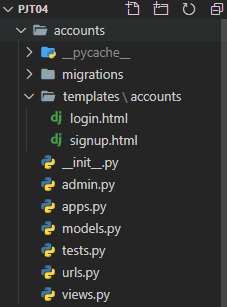
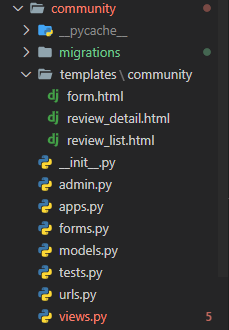
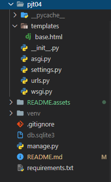
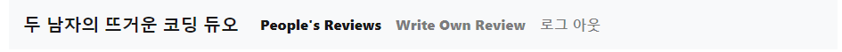
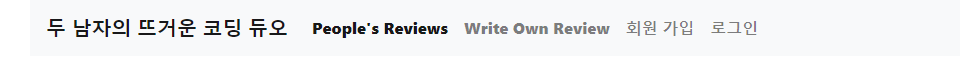
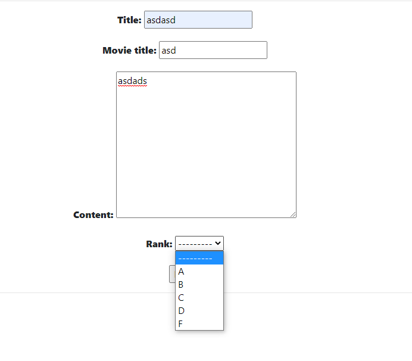
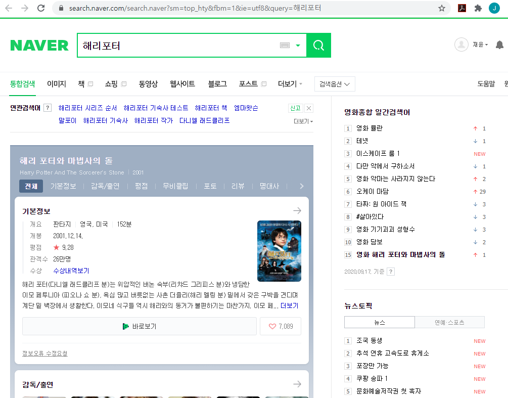
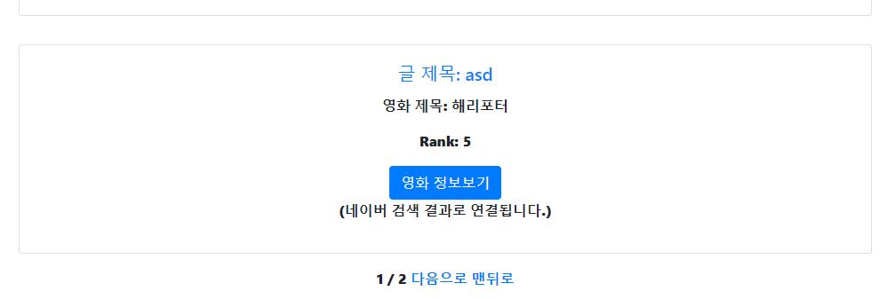

# Pjt04 프레임워크 기반 웹페이지 구현

- 데이터를 생성, 조회, 수정, 삭제 할 수 있는 Web Application 제작

- Python Web Framework를 통한 데이터 조작
- Object Relational Mapping에 대한 이해
- Django ModelForm을 활용한 HTML과 사용자 요청 데이터 관리

---

##### A. 우선 최종적으로 만든 프로젝트 구조는 다음과 같다







우선 프로젝트폴더 settings.py에 다음과 같은 설정들을 완료했다.

```python
INSTALLED_APPS = [
    'accounts',
    'community',
    'django_extensions',
    #'django_bootstrap4',
    'django.contrib.admin',
    'django.contrib.auth',
    'django.contrib.contenttypes',
    'django.contrib.sessions',
    'django.contrib.messages',
    'django.contrib.staticfiles',
]

TEMPLATES = [
    {
        'BACKEND': 'django.template.backends.django.DjangoTemplates',
        'DIRS': [BASE_DIR/'pjt04'/'templates'],
        'APP_DIRS': True,
        ...
    },
]

LANGUAGE_CODE = 'ko-kr'

TIME_ZONE = 'Asia/Seoul'
```

각각의 app에서 편리하게 url작성을 하기위해 넘겨주는 작업을 하고

```python
from django.contrib import admin
from django.urls import path, include

urlpatterns = [
    path('admin/', admin.site.urls),
    path('community/', include('community.urls')),
    path('accounts/', include('accounts.urls')),
]
```

아래와 같은 base.html을 기반으로 페이지를 만들었다.

```html
<!DOCTYPE html>
<html lang="en">
<head>
    <meta charset="UTF-8">
    <meta name="viewport" content="width=device-width, initial-scale=1.0">
    # bootstrap css
    <title>Document</title>
</head>
<body>
    <div class="container text-center">
        <nav class="navbar navbar-expand-lg navbar-light bg-light">
        <a class="navbar-brand" href="#"><strong>두 남자의 뜨거운 코딩 듀오<strong></a>
        <button class="navbar-toggler" type="button" data-toggle="collapse" data-target="#navbarSupportedContent" aria-controls="navbarSupportedContent" aria-expanded="false" aria-label="Toggle navigation">
            <span class="navbar-toggler-icon"></span>
        </button>

        <div class="collapse navbar-collapse" id="navbarSupportedContent">
            <ul class="navbar-nav mr-auto">
            <li class="nav-item active">
                <a class="nav-link" href="">People's Reviews<span class="sr-only">(current)</span></a>
            </li>
            <li class="nav-item">
                <a class="nav-link" href="">Write Own Review</a>
            </li>

            
                <li class="nav-item">
                    <a class="nav-link" href="">로그 아웃</a>
                </li>
            
            <li class="nav-item">
                <a class="nav-link" href="">회원 가입</a>
            </li>
            <li class="nav-item">
                <a class="nav-link" href="">로그인</a>
            </li>
            
            </ul>
            </form>
        </div>
        </nav>
        
        
    </div>
    #Bootstrap Js
</body>
</html>

```

---

- 다른내용들, 즉 CRUD의 작업들은 사실 Django를 배우며 자주 해왔던 작업이나, login과 관련된 작업들이 비교적 새로워서 회원가입, 로그인, 로그아웃 을 구현하고 base.html에도 조금 다르게 적용시켜보았다.

- 로그인을 했을시에는 다음과 같이



- 로그인한 상태가 아니라면 다음과 같이




##### B. Model 

아래와 같이 rank시스템을 약간 다르게 넣어보았다. 각각의 스코어를 스크롤로 올렸다 내렸다 하는

IntegerField() 가 아닌 IntegerChoicesField를 활용했다.

```python
from django.db import models

# Create your models here.
class Review(models.Model):

    class Scores(models.IntegerChoices):
        A = 5
        B = 4
        C = 3
        D = 2
        F = 1
        
    title = models.CharField(max_length=100)
    movie_title = models.CharField(max_length=50)
    content = models.TextField()
    rank = models.IntegerField(choices=Scores.choices)
    created_at = models.DateTimeField(auto_now_add=True)
    updated_at = models.DateTimeField(auto_now=True)

    def __str__(self):
        return self.title
```



---

위에 작성한 모델에서, 각각에 대한(A, B, etc) 에 대한 값을 숫자로 저장해주었는데, 그 값들이  Rank값에 저장이 된다.

그래서 Review_list에서는 다음과 같이 표시가 된다.


---

- Form, Admin, Url, View, Template 을 만드는 과정은 이전에 했던 플젝과 매우 유사해서 새로운 기능을 추가해보기로 했다.

- 그것은 Review_list에서 표시하는 정보가 카드로 나타내어지고, 그리고 아래에 있는 버튼을 누르면 자동으로 그 영화 제목((model 이름).movie_title에 저장된값)을 네이버에 검색한 결과를 새로 띄워주는 것이다.
- target="_blank" 이 부분을 찾아서 추가를 했으나 계속 안돼서 걱정하던 와중, 서버를 껐다가 켜니 다시 됐었다. 뭔가 확신이 있는데 생각대로 안될땐 빠르게 서버를 껐다 켜보자.

```python


<h1>ReviewList</h1>
<hr>

    
    <div class="row">
        <div class="card my-3 col" style="width: 18rem;">
            <div class="card-body">
                <a href="">
                <h5 class="card-title">글 제목: {{ review.title}}</h5>
                </a>
                <p class="card-text">영화 제목: {{ review.movie_title}}</p>
                <p> Rank: {{ review.rank}} </p>

                <a href="https://search.naver.com/search.naver?sm=top_hty&fbm=1&ie=utf8&query={{ review.movie_title }}" 
                class="btn btn-primary" target="_blank">영화 정보보기</a>
                <p class='text-center'>(네이버 검색 결과로 연결됩니다.)</p>
            </div>
        </div>
    </div>

...


```


위에 있는 파란색 블록 (영화 정보보기)를 클릭하면



위와 같은 새로운 창이 생긴다.


- 그리고 급작스러운 과제로 pagination을 검색해서 적용하게 되었다.
- 구글링을 열심히 해서 다음과 같이 review_list의 views.py를 바꾸고
- 여기서 인터넷에서 검색한것을 기반으로 우리의 모델에 맞게 적용하는 과정에서 error가 꽤 발생했었다.

```python
def review_list(request):
    reviews = Review.objects.all()
    review_l = Review.objects.order_by('-pk')
    paginator = Paginator(review_l, 3)
    page = request.GET.get("page")
    posts = paginator.get_page(page)
    context = {
        'reviews': reviews,
        'posts' : posts,
    }
    return render(request, 'community/review_list.html', context)
    # context = {
    #     'reviews': reviews,
    # }
    # return render(request,'community/review_list.html',context)
```

- base.html의 아랫단에 다음과 같이 추가해주었다.

```python


<h1>ReviewList</h1>
<hr>
...

<div class="mb-3">

    <a href="?page=1">맨 앞으로</a>
    <a href="?page={{posts.previous_page_number}}">이전으로</a>

    <span>{{posts.number}}</span>
    <span>/</span>
    <span>{{posts.paginator.num_pages}}</span>

    <a href="?page={{posts.next_page_number}}">다음으로</a>
    <a href="?page={{posts.paginator.num_pages}}">맨뒤로</a>

</div>
```



그럼 리뷰리스트 아래에 다음과 같이 페이지를 넘길 수 있게 추가가된다.

- 시간이 조금만 더 있다면 이해를 하고 넘어갈 수 있을 것 같아서 README는 이대로 작성을 하고 (현재시각오후5시56분)
- 따로 혼자만의 시간을 가지며 이해하는 시간을 가질 예정이다.


아주 재미있는 작업이었다.

