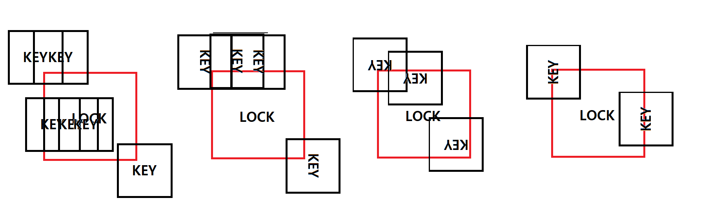

# 20200904

이번 주 동안 한 문제들 위주로 오늘의 수업이 진행됐다.

이미 풀어보고 화,목에 복습도 들었던 문제들이라 토요일 코테를 대비해 프로그래머스 문제들을 풀어봤다.

---

## 문자열압축

데이터 처리 전문가가 되고 싶은 **어피치**는 문자열을 압축하는 방법에 대해 공부를 하고 있습니다. 최근에 대량의 데이터 처리를 위한 간단한 비손실 압축 방법에 대해 공부를 하고 있는데, 문자열에서 같은 값이 연속해서 나타나는 것을 그 문자의 개수와 반복되는 값으로 표현하여 더 짧은 문자열로 줄여서 표현하는 알고리즘을 공부하고 있습니다.
간단한 예로 aabbaccc의 경우 2a2ba3c(문자가 반복되지 않아 한번만 나타난 경우 1은 생략함)와 같이 표현할 수 있는데, 이러한 방식은 반복되는 문자가 적은 경우 압축률이 낮다는 단점이 있습니다. 예를 들면, abcabcdede와 같은 문자열은 전혀 압축되지 않습니다. 어피치는 이러한 단점을 해결하기 위해 문자열을 1개 이상의 단위로 잘라서 압축하여 더 짧은 문자열로 표현할 수 있는지 방법을 찾아보려고 합니다.

예를 들어, ababcdcdababcdcd의 경우 문자를 1개 단위로 자르면 전혀 압축되지 않지만, 2개 단위로 잘라서 압축한다면 2ab2cd2ab2cd로 표현할 수 있습니다. 다른 방법으로 8개 단위로 잘라서 압축한다면 2ababcdcd로 표현할 수 있으며, 이때가 가장 짧게 압축하여 표현할 수 있는 방법입니다.

다른 예로, abcabcdede와 같은 경우, 문자를 2개 단위로 잘라서 압축하면 abcabc2de가 되지만, 3개 단위로 자른다면 2abcdede가 되어 3개 단위가 가장 짧은 압축 방법이 됩니다. 이때 3개 단위로 자르고 마지막에 남는 문자열은 그대로 붙여주면 됩니다.

압축할 문자열 s가 매개변수로 주어질 때, 위에 설명한 방법으로 1개 이상 단위로 문자열을 잘라 압축하여 표현한 문자열 중 가장 짧은 것의 길이를 return 하도록 solution 함수를 완성해주세요.

### 제한사항

- s의 길이는 1 이상 1,000 이하입니다.
- s는 알파벳 소문자로만 이루어져 있습니다.

##### 입출력 예

| s                            | result |
| ---------------------------- | ------ |
| `"aabbaccc"`                 | 7      |
| `"ababcdcdababcdcd"`         | 9      |
| `"abcabcdede"`               | 8      |
| `"abcabcabcabcdededededede"` | 14     |
| `"xababcdcdababcdcd"`        | 17     |

### 입출력 예에 대한 설명

**입출력 예 #1**

문자열을 1개 단위로 잘라 압축했을 때 가장 짧습니다.

**입출력 예 #2**

문자열을 8개 단위로 잘라 압축했을 때 가장 짧습니다.

**입출력 예 #3**

문자열을 3개 단위로 잘라 압축했을 때 가장 짧습니다.

**입출력 예 #4**

문자열을 2개 단위로 자르면 abcabcabcabc6de 가 됩니다.
문자열을 3개 단위로 자르면 4abcdededededede 가 됩니다.
문자열을 4개 단위로 자르면 abcabcabcabc3dede 가 됩니다.
문자열을 6개 단위로 자를 경우 2abcabc2dedede가 되며, 이때의 길이가 14로 가장 짧습니다.

**입출력 예 #5**

문자열은 제일 앞부터 정해진 길이만큼 잘라야 합니다.
따라서 주어진 문자열을 x / ababcdcd / ababcdcd 로 자르는 것은 불가능 합니다.
이 경우 어떻게 문자열을 잘라도 압축되지 않으므로 가장 짧은 길이는 17이 됩니다.

---

```python
def compress(s,l): # s 라는 문자열을 받아 l개씩 짤라서 압축할때의 전체 문자열길이 반환
    L = len(s)
    k = L//l # 총 길이 l의 토막이 몇개 존재하는지 따로 저장
    remain = L%l # 짜르고 난 나머지(그대로 길이에 더해줘야하는값)
    result = []
    for i in range(0, k): # k개의, 길이 l인 토막들을 s에서 하나씩 잘라서 result에 저장한다.
        a = ''
        for j in range(0,l): 
            a += s[i*l+j]
        result.append(a)
    
    #print(result)
    Q = [result[0]] # Q 안에 토막들을 하나씩 집어넣고 만약 같은 토막이 연속해서 들어간다면 상수값만 1 증가시키는걸 목표로 한다
    sang = 1 
    sangs = [] # 상수, 즉 계수값들을 저장해줄 리스트이다.
    ones = 0
    for i in range(1,k):
        if Q[-1] == result[i]: #직전에 들어간 토막이 같은 문자열인경우
            sang += 1 #상수에 1을 더해준다
            if i == k-1:
                sangs.append(sang) # 만약 근데 그게 마지막 문자열이었다면 그 상수값을 sangs에 넣는다.
        else:
            if sang == 1: # 1이라면 사실 숫자 없이 적기에 그냥 sang을 1로 초기화해주고, 토막을 Q에 집어넣는다.
                sang = 1
                Q.append(result[i])
            else:
                sangs.append(sang) # 1이 아니라면 상수값을 sangs에 저장하고 다음 상수값을 1로 초기화해준다. 물론 Q에 토막을 저장한다.
                sang = 1
                Q.append(result[i])
    #print(f'Q:{Q}')
    # final = ''
    # for strs in Q
    so = ''
    for nums in sangs:
        so = so + str(nums)
    # print(sangs)
    # print(remain + sum(sangs)*l + len(so))
    return remain + len(Q)*l + len(so) # 수학적 계산을 이용한 마지막에 반환될 문자열의 길이
    
    
def solution(s):
    answer = 1000 #우선 최대 글자수가 1000이므로 return 할 최솟값의 초기값을 1000으로 설정
    if len(s) == 1: # 길이가 1이면 그대로 1반환
        return 1
    else:
        for i in range(1,len(s)//2+1): # 그게 아니라면 i개씩 잘라서 압축을 실행해보자
            r = compress(s,i) # 반환된 길이를 변수에 저장해 최소값과 비교
            if answer > r:
                answer = r

        return answer
```

- 재미있는 문제였다. 생각보다 금방풀렸다 이 문제만큼은.

---

## 괄호변환

###### 문제 설명

카카오에 신입 개발자로 입사한 **콘**은 선배 개발자로부터 개발역량 강화를 위해 다른 개발자가 작성한 소스 코드를 분석하여 문제점을 발견하고 수정하라는 업무 과제를 받았습니다. 소스를 컴파일하여 로그를 보니 대부분 소스 코드 내 작성된 괄호가 개수는 맞지만 짝이 맞지 않은 형태로 작성되어 오류가 나는 것을 알게 되었습니다.
수정해야 할 소스 파일이 너무 많아서 고민하던 콘은 소스 코드에 작성된 모든 괄호를 뽑아서 올바른 순서대로 배치된 괄호 문자열을 알려주는 프로그램을 다음과 같이 개발하려고 합니다.

### 용어의 정의

**'('** 와 **')'** 로만 이루어진 문자열이 있을 경우, '(' 의 개수와 ')' 의 개수가 같다면 이를 **`균형잡힌 괄호 문자열`**이라고 부릅니다.
그리고 여기에 '('와 ')'의 괄호의 짝도 모두 맞을 경우에는 이를 **`올바른 괄호 문자열`**이라고 부릅니다.
예를 들어, `"(()))("`와 같은 문자열은 균형잡힌 괄호 문자열 이지만 올바른 괄호 문자열은 아닙니다.
반면에 `"(())()"`와 같은 문자열은 균형잡힌 괄호 문자열 이면서 동시에 올바른 괄호 문자열 입니다.

'(' 와 ')' 로만 이루어진 문자열 w가 균형잡힌 괄호 문자열 이라면 다음과 같은 과정을 통해 올바른 괄호 문자열로 변환할 수 있습니다.

```
1. 입력이 빈 문자열인 경우, 빈 문자열을 반환합니다. 
2. 문자열 w를 두 "균형잡힌 괄호 문자열" u, v로 분리합니다. 단, u는 "균형잡힌 괄호 문자열"로 더 이상 분리할 수 없어야 하며, v는 빈 문자열이 될 수 있습니다. 
3. 문자열 u가 "올바른 괄호 문자열" 이라면 문자열 v에 대해 1단계부터 다시 수행합니다. 
  3-1. 수행한 결과 문자열을 u에 이어 붙인 후 반환합니다. 
4. 문자열 u가 "올바른 괄호 문자열"이 아니라면 아래 과정을 수행합니다. 
  4-1. 빈 문자열에 첫 번째 문자로 '('를 붙입니다. 
  4-2. 문자열 v에 대해 1단계부터 재귀적으로 수행한 결과 문자열을 이어 붙입니다. 
  4-3. ')'를 다시 붙입니다. 
  4-4. u의 첫 번째와 마지막 문자를 제거하고, 나머지 문자열의 괄호 방향을 뒤집어서 뒤에 붙입니다. 
  4-5. 생성된 문자열을 반환합니다.
```

**균형잡힌 괄호 문자열** p가 매개변수로 주어질 때, 주어진 알고리즘을 수행해 **올바른 괄호 문자열**로 변환한 결과를 return 하도록 solution 함수를 완성해 주세요.

### 매개변수 설명

- p는 '(' 와 ')' 로만 이루어진 문자열이며 길이는 2 이상 1,000 이하인 짝수입니다.
- 문자열 p를 이루는 '(' 와 ')' 의 개수는 항상 같습니다.
- 만약 p가 이미 올바른 괄호 문자열이라면 그대로 return 하면 됩니다.

------

### 입출력 예

| p            | result       |
| ------------ | ------------ |
| `"(()())()"` | `"(()())()"` |
| `")("`       | `"()"`       |
| `"()))((()"` | `"()(())()"` |

### 입출력 예에 대한 설명

**입출력 예 #1**
이미 올바른 괄호 문자열 입니다.

**입출력 예 #2**

- 두 문자열 u, v로 분리합니다.

  - u = `")("`
  - v = `""`

- u가

   

  올바른 괄호 문자열

  이 아니므로 다음과 같이 새로운 문자열을 만듭니다.

  - v에 대해 1단계부터 재귀적으로 수행하면 빈 문자열이 반환됩니다.
  - u의 앞뒤 문자를 제거하고, 나머지 문자의 괄호 방향을 뒤집으면 `""`이 됩니다.
  - 따라서 생성되는 문자열은 `"("` + `""` + `")"` + `""`이며, 최종적으로 `"()"`로 변환됩니다.

**입출력 예 #3**

- 두 문자열 u, v로 분리합니다.

  - u = `"()"`
  - v = `"))((()"`

- 문자열 u가 올바른 괄호 문자열이므로 그대로 두고, v에 대해 재귀적으로 수행합니다.

- 다시 두 문자열 u, v로 분리합니다.

  - u = `"))(("`
  - v = `"()"`

- u가

   

  올바른 괄호 문자열

  이 아니므로 다음과 같이 새로운 문자열을 만듭니다.

  - v에 대해 1단계부터 재귀적으로 수행하면 `"()"`이 반환됩니다.
  - u의 앞뒤 문자를 제거하고, 나머지 문자의 괄호 방향을 뒤집으면 `"()"`이 됩니다.
  - 따라서 생성되는 문자열은 `"("` + `"()"` + `")"` + `"()"`이며, 최종적으로 `"(())()"`를 반환합니다.

- 처음에 그대로 둔 문자열에 반환된 문자열을 이어 붙이면 `"()"` + `"(())()"` = `"()(())()"`가 됩니다.

```python
def right(ls): # 항상 열린괄호가 같거나 많은지 판별하는 함수
    lSum = 0
    for l in ls:
        if l == '(':
            lSum += 1
        else:
            lSum -= 1
            if lSum < 0:
                return False
    
    return True
    
def rev(ls): # '(' 이면 ')'를 ')'이면 '('로 바꿔주는 함수
    result = []
    for l in ls:
        if l == '(':
            result.append(')')
        else:
            result.append('(')
    return ''.join(result)


def solution(p):
    L = len(p) 
    if L == 0: #우선 길이가 0인경우 빈 문자열을 반환한다.
        return ''
    else:
        smilesSum = 0
        splitPoint = 0
        for i in range(L): #u,v를 나누는 지점을 찾아보자.
            if p[i] == '(': 
                smilesSum += 1
                if smilesSum == 0: # 균형잡힌 문자열이 되는 순간을 찾는다.
                    splitPoint = i
                    break
            else:
                smilesSum -= 1
                if smilesSum == 0: # 균형잡힌 문자열이 되는 순간을
                    splitPoint = i
                    break
        
        #아래는 문제 그대로 그냥 작성했다.
        u = p[:splitPoint+1] 
        v = p[splitPoint+1:]
        if right(u):
            return u + solution(v)
        else:
            return '(' + solution(v) + ')' + rev(u[1:len(u)-1])
        
    return answer
```

- 논리를 정확히 이해하고 넘어가야하는 문제였다. 평소에 다른 괄호변환을 하다가 와서 그런지, 처음엔 문제를 제대로 읽지 않아 오류가 계속해서 났었다.

- 문제에 step by step으로 아주 잘 주어져서 비교적 쉽게 할 수 있었다.

---

## 자물쇠와 열쇠

###### 문제 설명

고고학자인 **튜브**는 고대 유적지에서 보물과 유적이 가득할 것으로 추정되는 비밀의 문을 발견하였습니다. 그런데 문을 열려고 살펴보니 특이한 형태의 **자물쇠**로 잠겨 있었고 문 앞에는 특이한 형태의 **열쇠**와 함께 자물쇠를 푸는 방법에 대해 다음과 같이 설명해 주는 종이가 발견되었습니다.

잠겨있는 자물쇠는 격자 한 칸의 크기가 **`1 x 1`**인 **`N x N`** 크기의 정사각 격자 형태이고 특이한 모양의 열쇠는 **`M x M`** 크기인 정사각 격자 형태로 되어 있습니다.

자물쇠에는 홈이 파여 있고 열쇠 또한 홈과 돌기 부분이 있습니다. 열쇠는 회전과 이동이 가능하며 열쇠의 돌기 부분을 자물쇠의 홈 부분에 딱 맞게 채우면 자물쇠가 열리게 되는 구조입니다. 자물쇠 영역을 벗어난 부분에 있는 열쇠의 홈과 돌기는 자물쇠를 여는 데 영향을 주지 않지만, 자물쇠 영역 내에서는 열쇠의 돌기 부분과 자물쇠의 홈 부분이 정확히 일치해야 하며 열쇠의 돌기와 자물쇠의 돌기가 만나서는 안됩니다. 또한 자물쇠의 모든 홈을 채워 비어있는 곳이 없어야 자물쇠를 열 수 있습니다.

열쇠를 나타내는 2차원 배열 key와 자물쇠를 나타내는 2차원 배열 lock이 매개변수로 주어질 때, 열쇠로 자물쇠를 열수 있으면 true를, 열 수 없으면 false를 return 하도록 solution 함수를 완성해주세요.

### 제한사항

- key는 M x M(3 ≤ M ≤ 20, M은 자연수)크기 2차원 배열입니다.
- lock은 N x N(3 ≤ N ≤ 20, N은 자연수)크기 2차원 배열입니다.
- M은 항상 N 이하입니다.
- key와 lock의 원소는 0 또는 1로 이루어져 있습니다.
  - 0은 홈 부분, 1은 돌기 부분을 나타냅니다.

------

### 입출력 예

| key                               | lock                              | result |
| --------------------------------- | --------------------------------- | ------ |
| [[0, 0, 0], [1, 0, 0], [0, 1, 1]] | [[1, 1, 1], [1, 1, 0], [1, 0, 1]] | true   |

### 입출력 예에 대한 설명


key를 시계 방향으로 90도 회전하고, 오른쪽으로 한 칸, 아래로 한 칸 이동하면 lock의 홈 부분을 정확히 모두 채울 수 있습니다.

---

문제에 대한 아래의 해법은 다음그림을 보면 이해하기 편하다(워낙 지저분하게 코드를 짰다)



- 우선 LOCK의 크기를 확장시키고, 확장한 부분들에 대해 모든값을 0 으로 바꾼다.
- KEY를 LOCK에 직접 비교를 하면서 구멍을 끼운다. (만약 KEY의 1과 LOCK의1이 닿아버리면 바로 다음칸으로 가서 처음부터 비교한다)

- 만약 닿은부분의 합이 1, 즉 구멍과 열쇠가 잘 맞물린 부분이라면, counter을 하나 증가시킨다. (일단 여기서 내가 간과했던것은, 열쇠의 1과 자물쇠의 0이 아닌 열쇠의 0과 자물쇠의1도 카운트 된다는 점이었다)
- 암튼 그것도 세세하게 신경써서, 열쇠가 자물쇠에 딱 끼워진 파트가 있을때만 counter을 1 증가시킨다.
- 만약 열쇠가 자물쇠에 잘 껴졌다고 하자(즉 닿은 부분들의합이 모두1). 그땐 그럼 counter값은 실제로 이 key가 얼마나 자물쇠의 구멍을 메웠는지를 나타내준다.
- 이 값이 처음부터 자물쇠에 뚫려있던 구멍갯수와 일치하는지 마지막으로 확인하고 결과값을 출력한다.

```python
def spin(G): # M*M 배열을 90도 회전시키는 함수 (정사각배열에만 가능한 회전함수)
    M = len(G)
    graph = [[0]*M for _ in range(M)]
    for row in range(0, M):
        for col in range(0, M):
            graph[col][M-row-1] += G[row][col]
    return graph

def treasure(G,key,i,j,M,N,holes): # 사실 별 인자들은 아니지만, 그냥 global대신 하나씩 넣어줬다. 괜히 이렇게 했다.
    counter = 0
    for row in range(M):
        for col in range(M):
            a = G[row+i][col+j] + key[row][col]
            if a > 1: # 합쳐진 부분이 1보다 크면 안맞는것이므로 바로 False 반환
                return False
            elif M-1 <= row+i < M-1+N and M - 1 <= col + j < M + N - 1: # 합쳐진 부분이 자물쇠 위에 있는 범위인지 확인.(처음부터 LOCK크기를 크게 만들었기에 필수적이다)
                if a == 1 and G[row+i][col+j] == 0: # 그리고 자물쇠파트가 구멍이 맞는지 확인
                    counter += 1 # 카운터 1 증가
            else:
                counter += 0 # 그게 아니라면 그대로둔다

    if counter == holes: # counter의 수가, 처음부터 LOCK에 뚫려있던 구멍수와 같으면 열린것이다.
        return True
    else:
        return False


def solution(key, lock): 
    M = len(key)
    N = len(lock)
    L = 2*M + N - 2 # 
    k = L - M
    graph = [[0]*L for _ in range(L)]
    holes = 0
    for row in range(N):
        for col in range(N):
            if lock[row][col] == 0:
                holes += 1
    print(holes)

    for row in range(M-1, M+N-1):
        for col in range(M-1, M+N-1):
            graph[row][col] += lock[row-M+1][col-M+1]
    # 이 위까지의 작업이 맨 처음 LOCK을 확장시키고, 구멍의 갯수를 작업이다.
    
    for s in range(4):
        for i in range(k+1):
            for j in range(k+1):
                if treasure(graph,key,i,j,M,N,holes):
                    return True
        key = spin(key)

    return False
```

- 상당히 나를 괴롭힌 문제이다. 문제 자체를 푸는 방식이 다양하게 존재할 수 있는데,
  계속 100프로 정답률이 나오질 않아서, 그냥 오류가 가장 적게 코드를 다시짰다(사실위에있는게 3번째? 4번째 코드이다)
- 중간중간에 다른걸 하다가 이 문제로 돌아오곤 했는데, 만약에 이걸 처음부터 딴짓안하고 시간을 측정하며 풀었다면 정말 긴 시간이 측정됐을것이라고 생각된다. 다른걸 하다가 온 fresh eye로도 처음엔 오류나 이상한 부분을 찾는데에 어려움이 있었다.