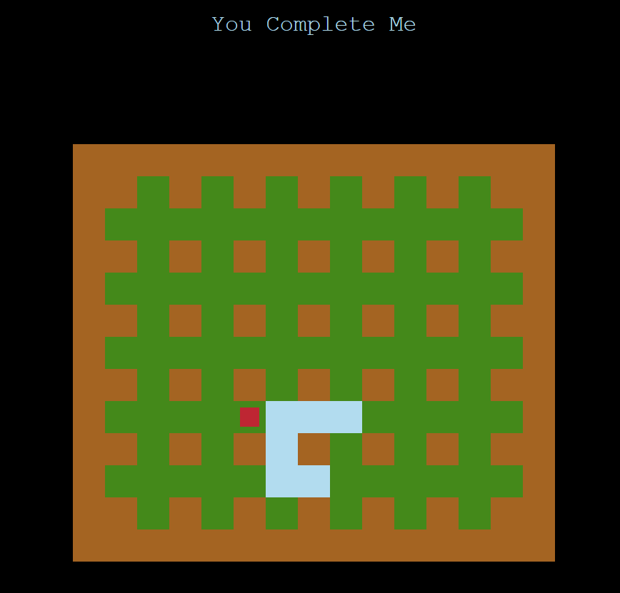

# 20200925

오늘은 IM 시험이 있는 날이었다. 시험이 끝나고 알고리즘 몇 문제를 풀었다.

### ⭐️필수⭐️ BOJ_10158_개미

[10158번: 개미](https://www.acmicpc.net/problem/10158)

```python
w, h = map(int, input().split())
p, q = map(int, input().split())
t = int(input())

hori = t % (2*w)
vert = t % (2*h)

dx = dy = 1
while hori > 0:
    if p == w:
        dx = -1
    elif p == 0:
        dx = 1
    p += dx
    #print(f'p:{p}')
    hori -= 1

while vert > 0:
    if q == h:
        dy = -1
    elif q == 0:
        dy = 1
    #print(f'q:{q}')
    q += dy
    vert -= 1

print(f'{p} {q}')
```

### ⭐️필수⭐️ BOJ_2669_직사각형 네개의 합집합의 면적 구하기

[2669번: 직사각형 네개의 합집합의 면적 구하기](https://www.acmicpc.net/problem/2669)

```python
G = [[0]*101 for _ in range(101)]

result = 0
for i in range(4):
    x1, y1, x2, y2 = map(int,input().split())
    for row in range(x1, x2):
        for col in range(y1, y2):
            if G[row][col] == 0:
                G[row][col] = 1
                result += 1

print(result)
```

---

## YOU COMPLETE ME

- 나만의 도전과제로 친구들과 인터넷서핑을 하다가 우연하게 발견한 간단 미니게임을 파이썬으로 해결해보기로 했다.



https://www.puzzlescript.net/play.html?p=caed4b1b41c6366464f7

```python
def whereTo(node, i):
    if i == 0:
        move = -1
        while G[node[0]+move][node[1]] == 1:
            move -= 1
        if G[node[0]+move][node[1]] == -1:
            return -1, -1
        else:
            return node[0]+move, node[1]

    elif i == 2:
        move = +1
        while G[node[0] + move][node[1]] == 1:
            move += 1
        if G[node[0] + move][node[1]] == -1:
            return -1, -1
        else:
            return node[0] + move, node[1]

    elif i == 1:
        move = 1
        while G[node[0]][node[1]+move] == 1:
            move += 1
        if G[node[0]][node[1]+move] == -1:
            return -1, -1
        else:
            return node[0], node[1] + move
    else:
        move = -1
        while G[node[0]][node[1] + move] == 1:
            move -= 1
        if G[node[0]][node[1] + move] == -1:
            return -1, -1
        else:
            return node[0], node[1] + move

def complete(k,node):
    if k == 99:
        print('hello')
    else:
        for i in range(4):
            if G[node[0] + dr[i]][node[1] + dc[i]] != -1:
                r, c = whereTo(node, i)
                if r != -1:
                    G[r][c] += 1
                    result.append(i)
                    print(f'k: {k} i: {i} result:{result} complete{k+1} {r},{c}')
                    complete(k+1, [r,c])
                    G[r][c] -= 1
                    result.pop()


# 움직일 그래프 만들기 벽은 -1 잔디는 0
G = [[-1 for _ in range(15)]]
Ls1 = [-1,-1,0,-1,0,-1,0,-1,0,-1,0,-1,0,-1,-1]
Ls2 = [-1,0,0,0,0,0,0,0,0,0,0,0,0,0,-1]

for i in range(5):
    G.append(Ls1)
    G.append(Ls2)
G.append(Ls1)
G.append([-1 for _ in range(15)])
dr = [-1,0,1,0]
dc = [0,1,0,-1]

result = []
start = [10,7]
G[10][7] += 1

complete(1,start)
print(G)
```


미완이다... 있다가 새벽에 다시 해볼 예정이다.