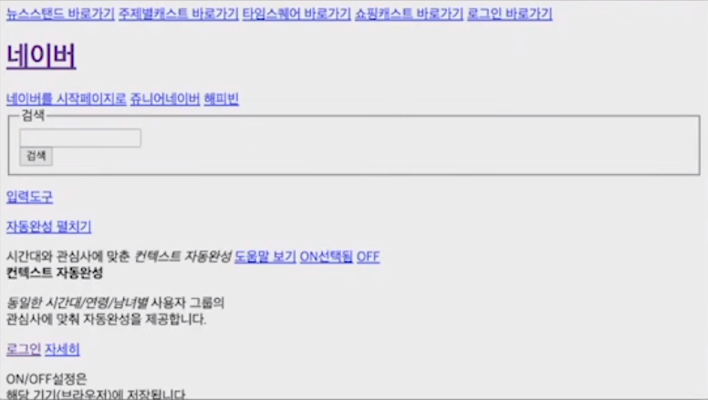
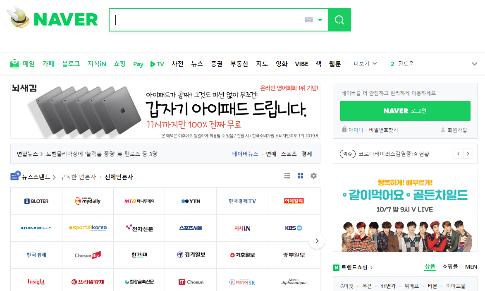
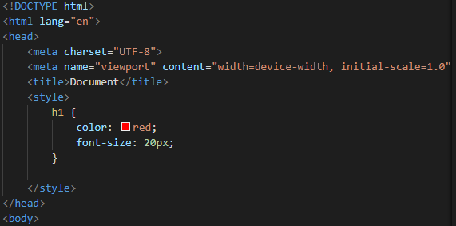

# CSS

**CSS (Cascading Style Sheets)**

- Cascade: 떨어져내리다 라는 뜻

- 다음은 CSS를 적용시키지 않은 Naver 홈페이지의 모습이다

- 그리고 우리가 평소에 보는 Naver 홈페이지는 다음과 같다

---

- 위 아래 둘 다 HTML 문서이지만, 위 HTML에 CSS(style & layout)를 적용해 아래와 같이 사람들에게 제공할 수 있다.

즉 CSS는 **스타일, 레이아웃을 통해 HTML을 표시하는 방법을 지정하는 언어** 이다

## CSS 구문

- 구문은 선택자와 함께 열린다. 
- 스타일을 지정할 html 요소를 선택. 
- 다음 중괄호가 있는데 이 안에는 속성과 값 쌍 형태를 가지는 하나 또는 그 이상의 선언(declaration)이 있다. 
- 각 쌍은 우리가 선택한 요소의 속성을 지정하고 속성에 부여할 값을 지정한다.

**선언문** 

- 속성 (Property)
  - 사람이 읽을 수 있는 식별자로, 어떤 (글꼴, 너비, 배경색 등) 스타일 기능을 변경할지 나타냅니다.
- 값 (Value)
  - 각 속성에는 값을 부여한다.
  - 값은 어떻게 (글꼴을 이걸로, 배경 색을 저걸로 등)스타일 기능을 변경할 건지 나타낸다.

**CSS 정의 방법**

1. `Inline style` : 한 줄에 표현 - 그 요소 태그 안에 표현

   

2. 내부 참조 (`Embedding style`) : Head에 style태그를 만들어 작성

   

3. 외부 참조 (`Link style`) : 외부 CSS 파일을 `<head>`내 `<link>`를 통해 불러오기

   

---

## CSS Selector

> 선택자는 스타일을 지정할 웹 페이지의 HTML 요소를 대상으로 하는 데 사용

**전체 선택자**

- 전체를 선택해 style을 적용시킬 수 있다(자주 쓰이진 않을것 같다)

**클래스(class) 선택자**

- 클래스 선택자는 마침표( .) 문자로 시작 하며 해당 클래스가 적용된 문서의 모든 항목을 선택

**아이디(id) 선택자**

- 아이디 선택자는 `#` 문자로 시작하며 기본적으로 클래스 선택자와 같은 방식으로 사용
- 그러나 아이디는 문서 당 한 번만 사용할 수 있으며 요소에는 단일 id값만 적용 할 수 있다
- 문서에서 동일한 아이디를 여러 번 사용해도 동작하나 그렇게 하면 안된다.

**복합 선택자**

- 자손(하위의 모든 요소) : 셀렉터a  `공백` 셀렉터b
- 자식(바로 아래의 요소) : 셀렉터a `>` 셀렉터b

**적용 우선순위**

1. `!important`
   - 다른 사람들의 코드에서 발견할 때 그 의미를 알 수 있는 것은 좋다.
   - 하지만 반드시 필요한 경우가 아니면 절대 사용하지 않는 것이 좋다.,
   - `!important` 는 cascading이 정상적으로 작동하는 방식을 변경하므로, CSS 스타일 문제를 해결하기가 어렵습니다.
2. inline style
3. id 선택자
   - id는 대부분의 다른 선택자보다 우선순위가 높기 때문에 다루기가 어려워 질 수 있다.
   - 대부분의 경우 id 보다는 모두  class 선택자로 작성하는 것이 좋다.
   - 만약 문서 내 `링크 이동`이나 `for`를 사용하는 특별한 경우에만 아이디를 사용한다.
4. class 선택자
5. 요소 선택자
6. 소스 순서

---

## CSS 단위

**(상대) 크기 단위**

**px**

- 모니터 해상도의 한 화소인 '픽셀'을 기준
- 픽셀의 크기는 변하지 않기 때문에 고정적인 단위

**%**

- 백분율 단위
- 가변적인 레이아웃에서 자주 사용

**em**

- em은 상속의 영향 받음, rem은 최상위 요소(html)를 기준으로 결정됨.
- 상황에 따라 각기 다른 값을 가질 수 있다.

**rem**

- 최상위 요소인 html(root em)을  절대 단위를 기준으로 삼음. 상속의 영향을 받지 않음.
- 상속에 영향을 받지 않기 때문에 대부분의 경우 `rem` 을 많이 사용한다.

**viewport**

- (스크롤을 내리지 않은 상태에서) 웹 페이지를 방문한 유저에게 현재 보이는 웹 컨텐츠의 영역
- viewport를 기준으로한 상대적인 사이즈
- 주로 스마트폰이나 테블릿 디바이스의 화면을 일컫는 용어로 사용된다.
- vw, vh

**색상 표현 단위**

1. 색상 키워드
   - 색상 키워드는 대소문자를 구분하지 않는 식별자로, red, blue, black처럼 특정 색을 나타낸다
2. RGB 색상
   - 빨강, 초록, 파랑을 통해 특정 색을 표현
   - 16진수 표기법이나 함수형 표기법으로 사용
   - a는 alpha(투명도)가 추가된 것
3. HSL 색상
   - 색상, 채도, 명도를 통해 특정 색상을 표현
   - a는 alpha(투명도)가 추가된 것

---

## Box Model

> 웹 디자인은 contents를 담을 box model을 정의하고 CSS 속성을 통해 스타일(배경, 폰트와 텍스트 등)과 위치 및 정렬을 지정하는 것.

- 모든 HTML 요소는 box 형태로 되어있다.
- 하나의 박스는 네 부분(영역)으로 이루어 진다.
  - content / padding / border / margin

1. Content
   - 글이나 이미지, 비디오 등 요소의 실제 내용
2. Padding (안쪽 여백)
   - Border(테두리) 안쪽의 내부 여백
   - 배경색, 이미지 지정 가능
3. Border
4. Margin (바깥쪽 여백)
   - 테두리 바깥의 외부 여백
   - 배경색 지정 불가

**마진 상쇄**

- block의 top 및 bottom margin이 때로는 (결합되는 마진 중 크기가) 가장 큰 한 마진으로 결합(combine, 상쇄(collapsed))된다.

---

## Display

> display CSS 속성은 요소를 블록과 인라인 요소 중 어느 쪽으로 처리할지와 함께 자식 요소를 배치할 때 사용할 레이아웃을 설정한다.

**block**

- 쌓이는 박스
- 요소는 블록 요소 상자를 생성하여 일반 흐름에서 요소 앞뒤에 줄 바꿈을 생성한다.
- 블록 레벨 요소안에 인라인 레벨 요소가 들어갈 수 있다.

**inline**

- 줄바꿈이 일어나지 않는 행의 일부 요소
- content 너비만큼 가로 폭을 차지
- width, height, margin-top, margin-bottom을 지정할 수 없음
- 상하 여백은 line-height로 지정

**inline-block**

- inline 처럼 텍스트 흐름대로 나열, block처럼 박스 형태이기 block 속성 사용가능.

**none**

- 해당 요소를 화면에서 사라지게 하며 요소의 공간조차 사라지게 한다.
- `visibility: hidden;`은 해당 요소를 화면에서 사라지게는 하나 공간은 사라지지 않는다.

---

## Position

**박스의 위치 속성 & 값**

- position
  - static / absolute / relative / fixed
  - z-index

**기본 개념**

1. static (기본 위치)
   - 모든 태그의 기본
   - 태그의 default 값
2. relative (상대 위치)
   - 기본 위치(static)를 기준으로 좌표 속성을 사용해 위치 이동
3. absolute (절대 위치)
   - static 이 아닌 부모/조상 요소를 기준으로 좌표 속성 만큼 이동
   - 부모 요소를 찾아가고 나아가 없다면 body에 붙는다.
4. fixed (고정 위치)
   - 부모/조상 요소와 관계없이 브라우저의 viewport를 기준으로 좌표 속성 만큼 이동
   - 스크롤을 내리거나 올려도 화면에서 사라지지 않고 항상 같은 곳에 위치

**absolute**

- `absolute`는 원래 위치해 있었던 과거 위치에 있던 공간은 더 이상 존재하지 않는다는 점이 특징이다.
- 즉, 다른 모든 것과는 별개로 독자적인 곳에 놓이게 된다.
- 언제 쓸까?
  - 페이지의 다른 요소의 위치와 간섭하지 않는 격리된 사용자 인터페이스 기능을 만들 수 있다.
  - 팝업 정보 상자 및 제어 메뉴, 롤오버 패널, 페이지 어느 곳에서나 끌어서 놓기할 수 있는 유저 인터페이스 페이지 등

