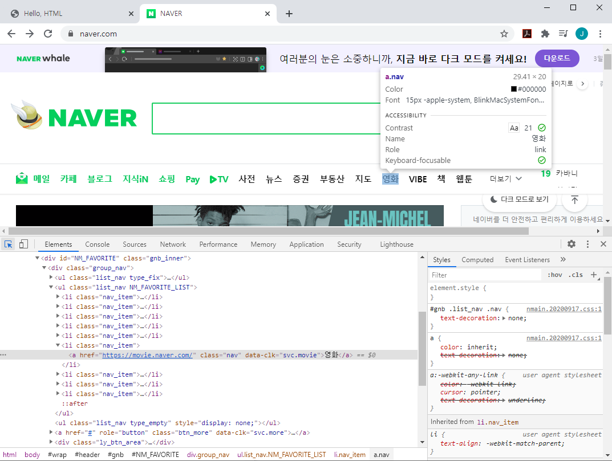

# Web

​	*우리가 흔히 사용하는 **Chrome**, **FireFox**, **Internet Explorer** 등의 브라우저들은 다 동작법들이 비슷하다. 그것은 다 같은 어떠한 표준을 지키고 있기 때문이다.*

​	*이 표준을 재정하는 두 단체는 `W3C` (World Wide Web Consortium)라는 기구와 WHATWH(Web Hypertext Application Technology Working Group) - Apple, Google, Microsoft, Mozilla라는 그룹이다. 두 그룹은 각각 `HTML5`, `HTML Living Standards` 라는 표준을 내세웠다. 원래는 `W3C` 에서 주도적으로 표준을 정했다. 하지만 Web의 발전보다 `W3C`의 표준재정이 현저히 느린 속도로 진행되다보니 `WHATWH`에서 자체적으로 브라우저에 기능들을 탑재하기 시작하다가, 최근에 두 단체가 함께 표준을 재정하기로 했다. (기술주도권은 WHATWG에게 있다)*

---

​	Web Applications을 구현할 때 과연 내가 구현하기 위해 이용하는 코드가 특정 브라우저들에서 적용이 되는지 확인하고 싶다면 https://caniuse.com/ 에서 직접 검색이 가능하다.


---

# HTML (Hyper Text Markup Language)

**Hyper Text** 란?


- 동일선상으로 페이지들이 연결되어 있지 않고, 위와 같이 다중으로 페이지간의 이동을 할 수 있게 해주는 기술을 `Hyper Text`기술이라 한다.

**Markup** **Language **란?

- 태그 등을 이용해 문서나 데이터의 구조를 명시하는 언어 (`<h1>`,`<h2>`, etc)
- "마크업을 한다" 는 것은 제목이 제목이라고, 본문이 본문이라고 마킹을 하는것이다
- 예를들어` <h1>`은 단순히 글자가 커디는게 아닌 의미론적으로 핵심주제를 말하는것이다
- Python등의 프로그래밍언어와는 다르게, 그저 표현하기만 한다
- ex) HTML, Markdown

---

#### 즉 **HTML** 은 웹 페이지를 작성하기 위한(구조를 잡기 위한) 언어, **웹 컨텐츠의 의미와 구조를 정의** 하는 언어이다.

---

### HTML 기본구조

- <html 요소>
  - HTML문서의 최상위 요소로 문서의 root를 뜻한다. 그 안에 head와 body가 있다.

- <head 요소>

  - 문서 제목, 문자코드(인코딩)와 같이 해당 문서 정보를 담고 있다. 눈에 보이는 브라우저에는 나타나지 않는 정보이다. CSS 선언이나 외부 로딩 파일 지정 등도 이곳에 작성한다.
  - 우리가 흔히 사용하는 `Open Graph Protocol` (아래 사진 참고)도 이곳에 들어간다. 

  - head에 들어가는 meta태그를 이용해서, 메타정보에 해당하는 제목, 설명 등을 쓸 수 있도록 정의한것이다.  - Facebook이 만들었다


- <body 요소>
  - 브라우저 화면에 나타나는 정보를 담은 요소

```html
<!-- "이 문서가 HTML5 문서다" 라고 선언-->
<!DOCTYPE html>

<!-- 최상위태그 -->
<html>
  <head>
    <meta charset="UTF-8">
    <!-- tab 이름 -->
    <title>Hello, HTML</title>
  </head>
  <body>
    <!-- 이것은 주석입니다.-->
    <h1> 나의 첫번째 HTML </h1>
    <a href="https://naver.com">네이버로 고고!</a>
  </body>
</html>
```


---

### DOM (Document Object Model) - 문서의 구조화된 표현


- html문서를 작성할때 부모에 속한 자식 태그를 입력할 시에는 2 or 4 space로 구분을 잘 해주어야한다.

---

#### HTML의 요소 (Element)

- HTML 요소는 시작 태그와 종료 태그 그리고 태그 사이에 위치한 내용으로 구성
- 태그(Element, 요소)는 컨텐츠(내용)를 감싸서 그 정보의 성격과 의미를 정의 한다
  - ex) `<h1>` content `</h1>`

- 그리고 각 태그마다 안에 사용할 수 있는 `속성(attribute)`이 다르다

  - 속성(Attribute)은 태그의 부가적인 정보를 넣을 때 사용한다
  - 각 요소는 속성을 가질 수 있으며 요소에 추가적 정보(이미지 파일의 경로, 크기 등)를 제공한다

  - 요소의 시작 태그에 위치해야 하며 이름과 값의 쌍을 이룬다

- 속성은 공백없는 `=`로 연결하고 그 속성값을 담을땐`"`를 꼭 사용하자

  - ex) `<a href="https://google.com">` 구글로 가는 태그 `</a>`

- 그와 반면에 모든 HTML 요소가 사용할 수 있는 속성(html global attribute)도 존재한다

  - ex) id, class, hidden, lang ...

- 안에 내용을 작성하지 않는 태그들도 있다
  - `<br>` `<hr>` ,``  등의 태그들은 `</br>` 과 같은 닫는 태그나 Content가 따로 없다

- 간단히 작성해보면


- 위와 같은 코드의 결과(`open in browser` extension을 다운받아 사용하면)를 `alt` + `b` 로 열어보면 아래와 같은 결과가 나온다
  - 저장을 항상 하고나서 브라우저를 열어야한다!


- Semantic Tags

  - 말그대로 시맨틱(Semantic), "의미의, 의미론적인" 태그들이다.
  - 흔히 사용하는 `<div>` 등의 태그와 다르게 `<table>` `<article>` 등의 태그는 그 안에 `표`, `글` 등이 들어간다는것을 유추할 수 있다.
  - 브라우저, 검색엔진, 개발자 모두에게 의미를 명확하게 해준다.
  - HTML 문서는 html 언어 + 사람이 읽을 수 있는 content의 조합이다
  - 검색 엔진은 HTML 코드만 잘 읽기 때문에 검색 엔진이 HTML을 잘 이해하도록 시맨틱 태그 사용이 권장되고, 그러면 검색 엔진도 무슨 내용인지 이해할 수 있게 된다
  - ex) 예를들면 구글에 naver을 검색해보면 시맨틱 태그가 잘 되어있다면 아래와 같이 검색엔진에서 알아서 깔끔하게 정리를 해서 나타내주기도 한다.

   

  

- 항상 열고 닫는 태그 쌍이 잘 맞는지 잘 봐야한다

- HTML은 오류를 뿜지 않고 그냥 레이아웃이 깨져버리기 때문에 어떤 면에서는 친절하게 오류를 찾아서 보여주는 프로그래밍 보다 디버깅이 힘들다

---

#### 관리자도구

- 관리자도구는 아래와 같은 방법들로 열 수 있다.
  - `F12` , 우측 마우스클릭 후 `검사`, `Ctrl` + `Shift` + `i`
- 그럼 아래와 같이 관리자 도구가 열린다.


- 여기서도 볼 수 있듯, Naver도 HTML의 기본 구조를 따르고 있다

  

  - Inspect 버튼(개발자도구 좌측상단)을 사용해서 자세히 보고 싶은 블록을 직접 눌러볼 수 있다

    


###  Semantic Web(시맨틱 웹)

- 웹에 존재하는 수많은 웹페이지들에 메타데이터를 부여하여, 기존의 단순한 데이터 집합이었던 웹페이지를 '의미'와 '관련성'을 가지는 거대한 데이터베이스로 구축하고자 하는 발상

---

## HTML 문서 구조화

- Group Contents

  - `<p>` : paragraph
  - `<hr>`: headline
  - `<ol>` `<ul>` : orderedlist, unorderedlist

- Text Related

  - `<a>`: 하이퍼링크를 만들어주는 태그

  - `<b>` vs `<strong>` 

    - b는 bold의 약자, strong도 똑같이 글자를 굵게 만들어준다

    - 하지만 `strong`태그는 시멘틱태그로, 의미론적으로 부여를 해놓은 태그이다
    - 예를들면 시각장애인을 위한 검색엔진시스템에서 strong태그는 중요하다고 읽는다

  - `<i>` vs `<em>`

    - 둘 다 이태릭체로 바꾸어줌

  - `<span>`, `<br>`, `` 등

- Table

  - `<tr>`,  `<td>`, `<th>`
    - 행을 알려주는태그, 행의 제목, 열을 나타내는 태그
  - `<thead>` . `<tbody>`. `<tfoot>`
    - 태이블을 구조적으로 나워주는 태그
  - `<caption>`
  - 셀 병합 속성: `<colspan>`, `<rowspan>`
  - `scope` 속성
  - `<col>`, `<colgroup>`

- Form
  - `<form>`은 서버에서 처리될 데이터를 제공하는 역할 - 매우 중요하다
  - `<form>`의 기본 속성으로는
    - action : 어디로 보낼지
    - method : GET, POST 등의 방법

- input
  - 다양한 타입을 가지는 입력 데이터 필드(form 태그 안에는 반드시 input 태그가 존재한다)
  - `<label>` : 입력 요소의 캡션
  - input의 공통 속성
    - name, placeholder
    - required
    - autofocus

---

Ex) 미궁난이도 설문 페이지 만들기

```html
<!DOCTYPE html>
<html>
<head>
    <meta charset="UTF-8">
    <title>My First Markup</title>
</head>
<body>
    <header>
        
        <h1> 미궁난이도 설문 </h1>
    </header>
    <section>
        <form action="#" method="GET">
            <div>
                <!-- for="" 안에 들어가는것에 대한 label을 뜻함 -->
                <label for="name">본인의 아이디를 입력해주세요</label><br>
                <!-- autofocus: 페이지에 들어가면 바로 그곳에 커서가 가있음 -->
                <input type="text" id="name" autofocus>
            </div>
            <div>
                <label for="problem">가장 최근에 푼 미궁이름을 선택해주세요</label>
                <select name="problem" id="problem">
                    <!-- url 뒤에 "?problem="뒤에 올 각 선택지의 값이 value이다 -->
                    <option value="">선택</option>
                    <option value="Maze">Maze</option>
                    <option value="White Room">White Room</option>
                    <option value="Black Room">Black Room</option>
                    <!-- disabled는 선택하지 못하는 option으로 바꾼다 -->
                    <option value="Out of Jail" disabled>Out of Jail</option>
                </select>
            </div>
            <div>
                <p>자신이 느꼈던 어려운/쉬운 정도를 선택해주세요</p>
                <input type="radio" name="level" id="challenging" value="challenging">
                <label for="challenging">매우 어려웠음</label>
                <input type="radio" name="level" id="hard" value="hard">
                <label for="hard">어려웠음</label>
                <input type="radio" name="level" id="soso" value="soso">
                <label for="soso">그냥저냥 괜찮았음</label>
                <input type="radio" name="level" id="easy" value="easy">
                <label for="easy">쉬웠음</label>
                <input type="radio" name="level" id="tooeasy" value="tooeasy">
                <label for="tooeasy">매우 쉬웠음</label>
            </div>
            <input type="submit" value="제출하기">
        </form>
    </section>
    <footer>
        Google 설문지를 통해 비밀번호를 제출하지마시오
    </footer>
</body>
</html>
```

